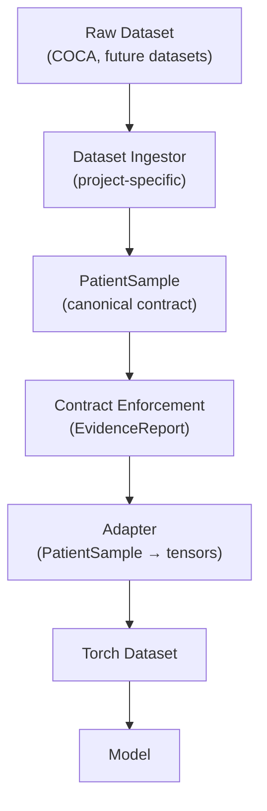
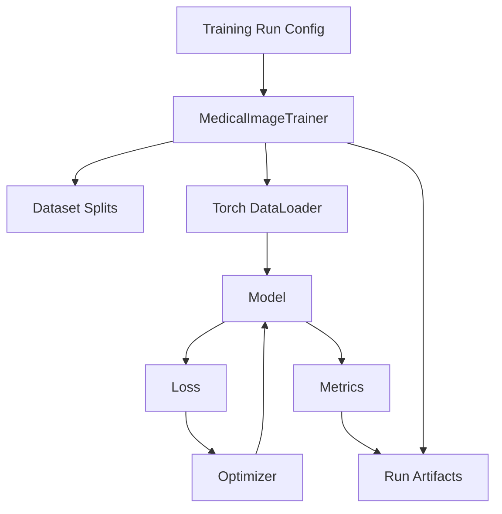

# Current State Design & Conventions
**Project:** Coronary CT ML Pipeline  
**Last Updated:** 2026-01-28  
**Status:** Active – authoritative snapshot of current architecture and conventions

---

## 1. Purpose

This document describes the **current, authoritative design state** of the project.

It answers:
- What abstractions exist today
- Where responsibilities live
- What assumptions downstream code may rely on
- What conventions are considered “locked” at this stage

This document is intended to:
- Reduce cognitive load
- Prevent accidental architectural drift
- Serve as a reference during implementation, testing, and training

Historical rationale is captured separately in the Design History (DHF-lite).

---

## 2. High-Level Architecture

### Design Principle
The system is divided into:
- **Reusable medical imaging framework code** (`medical_image_ai_toolkit`)
- **Project- and dataset-specific code** (`coronary_prj`)

Framework code must be importable and usable as if it were an external package.

---

## 3. Core Data Contract

### PatientSample

`PatientSample` is the canonical patient-level data representation.

**Guaranteed fields:**
- `image_volume`: NumPy array, shape `(z, y, x)`
- `spacing`: `(z, y, x)` tuple, all values > 0
- `patient_id`: non-empty string
- `annotations`: optional; supported formats:
  - Vector ROIs (slice-indexed)
  - Dense raster mask (NumPy array)

**Contract enforcement:**
- All invariants are enforced by:
  ```python
  enforce_patient_sample_contract(...)
    ```
- This is the single contract boundary
- Downstream code assumes validated inputs

---

## 4. Data Contract Enforcement & Integrity Checks

This project performs **data contract enforcement**, not model or clinical validation.

Purpose:
- Ensure structural and semantic correctness of data objects
- Detect ingestion, parsing, or alignment errors early
- Produce auditable evidence of data integrity

### Key Principles

- Contract enforcement is **explicit and centralized**
- Enforcement produces **evidence reports**, not exceptions
- Enforcement is performed at defined system boundaries
- Downstream components assume inputs satisfy enforced contracts

### PatientSample Contract Enforcement

All `PatientSample` invariants are enforced by a single boundary function:

```python
enforce_patient_sample_contract(...)
```

This function:
- Checks required fields and structural assumptions
- Verifies annotation integrity and bounds
- Supports multiple annotation representations (vector or dense)
- Emits an EvidenceReport containing:
    - `INFO` (confirmed assumptions)
    - `WARNING` (non-fatal deviations)
    - `ERROR` (contract violations)

### Evidence Reports
Evidence reports are treated as first-class artifacts:
- They may be logged, persisted, or attached to training runs
- They support debugging, audits, and dataset characterization
- They are distinct from test assertions and runtime logs

### Separation of Concerns
Contract enforcement logic is isolated from:
- Dataset ingestion
- Dataset iteration
- Model training
- Loss or metric computation

Tests verify enforcement behavior; enforcement does not depend on tests.

---

## 5. medical_image_ai_toolkit (Framework Code)
### Scope

May include:
- Trainers
- Datasets
- Adapters
- Task abstractions
- Losses, metrics, logging utilities

May NOT include:
- Dataset-specific assumptions
- Project-specific label logic
- Hard-coded paths or splits

### Trainer

A reusable training container will be provided:
```python
MedicalImageTrainer
```

Responsibilities:
- Orchestrate training
- Accept configuration, not data
- Load data lazily
- Capture training artifacts

## 6. coronary_prj (Project Code)

Responsibilities:
- Dataset ingestion wiring (e.g. COCA)
- Dataset splits
- Task definitions
- Label semantics
- Visualization and debugging scripts
- Training run scripts

All CAC-specific logic lives here.

---

## 7. Dataset Splits

- Current strategy: deterministic hash(patient_id)
- Splits are project-level policy
- Split logic must be reproducible and documented
- Trainer treats splits as configuration input

## 8. Training Artifacts & Traceability

Training runs are first-class artifacts.

Each run must capture:
- Dataset root(s) used
- Split definition
- Model configuration
- Training parameters
- Validation metrics
- Visual evidence where applicable

Artifact capture is required to support:
- Debugging
- Reproducibility
- Future regulatory submissions

9. Current Status

- `PatientSample` contract finalized
- Validation system complete and tested
- Adapter tests passing
- Training architecture defined but not yet executed

Next step: smoke-test training run with visual outputs

10. Change Policy

Any change that affects:
- Data contracts
- Module boundaries
- Training responsibilities

Must:
- Update this document
- Trigger a new Design History (DHF-lite) entry


---

## Data Flow Overview



---

## Training Loop Overview

