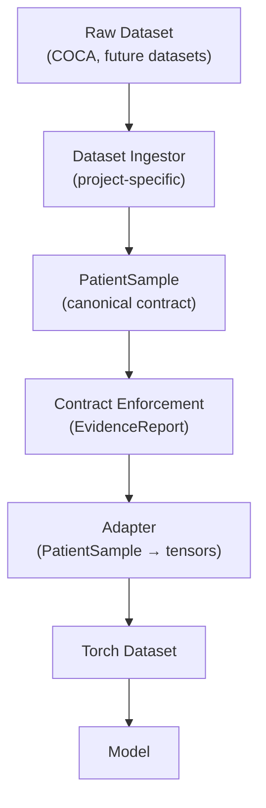
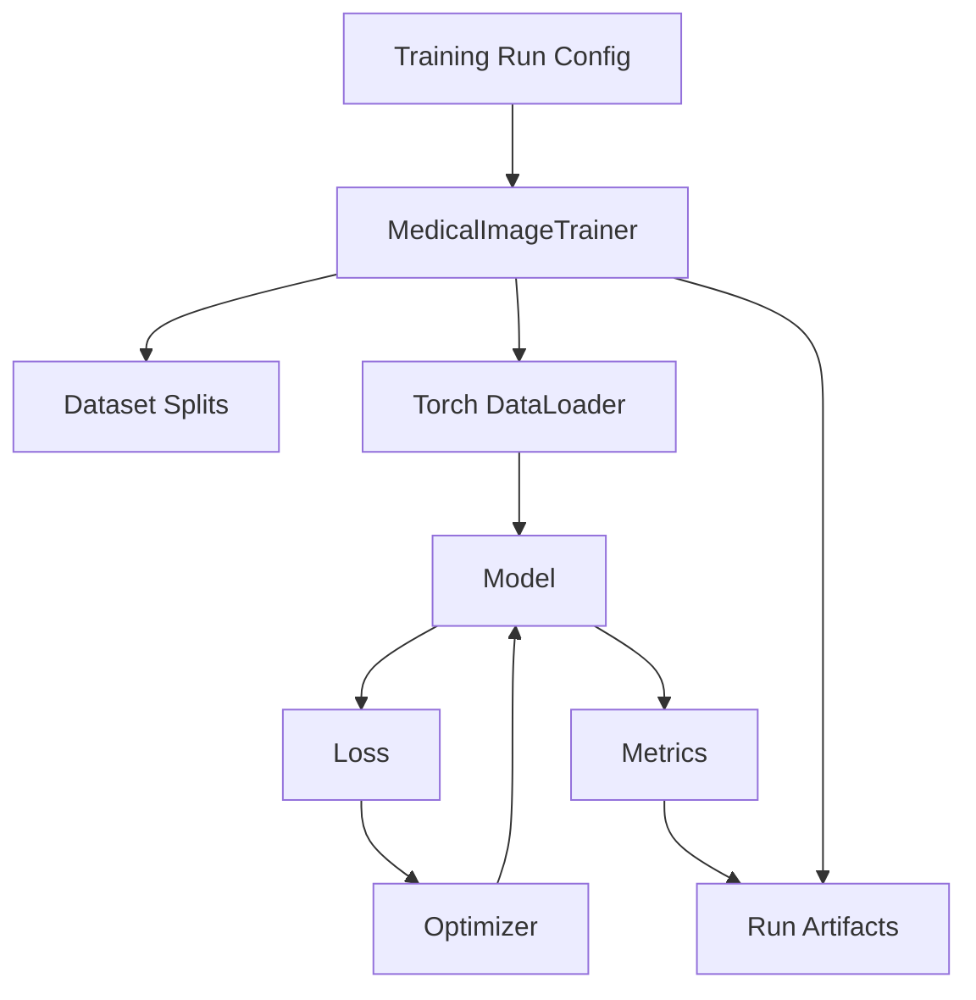

# Current State Design & Conventions
**Project:** Coronary CT ML Pipeline  
**Last Updated:** 2026-01-31
**Status:** Active – authoritative snapshot of current architecture and conventions

---

## 1. Purpose

This document describes the **current, authoritative design state** of the project.

It answers:
- What abstractions exist today
- Where responsibilities live
- What assumptions downstream code may rely on
- What conventions are considered “locked” at this stage

This document is intended to:
- Reduce cognitive load
- Prevent accidental architectural drift
- Serve as a reference during implementation, testing, and training

Historical rationale is captured separately in the Design History (DHF-lite).

---

## 2. High-Level Architecture

### Design Principle
The system is divided into:
- **Reusable medical imaging framework code** (`medical_image_ai_toolkit`)
- **Project- and dataset-specific code** (`coronary_prj`)

Framework code must be importable and usable as if it were an external package.

---

## 3. Process and Conventions
- “Validation” is a reserved word
This project is intended to demonstrate rigorous, regulatory-ready AI development for medical imaging
- Reporting and artifact generation are first-class requirements
- Errors, deviations, and contract violations MUST report to EvidenceReport and generate auditable artifacts
- Silent failure is explicitly disallowed at system boundaries

---

## 3. Core Data Contract

### PatientSample

`PatientSample` is the canonical patient-level data representation.

**Guaranteed fields:**
- `image_volume`: NumPy array, shape `(z, y, x)`
- `spacing`: `(z, y, x)` tuple, all values > 0
- `patient_id`: non-empty string
- `annotations`: optional; supported formats:
  - Vector ROIs (slice-indexed)
  - Dense raster mask (NumPy array)

**Contract enforcement:**
- All invariants are enforced by:
  ```python
  enforce_patient_sample_contract(...)
    ```

  This function:
  - Checks required fields and structural assumptions
  - Verifies annotation integrity and bounds
  - Supports multiple annotation representations (vector or dense)
  - Emits an EvidenceReport containing:
      - `INFO` (confirmed assumptions)
      - `WARNING` (non-fatal deviations)
      - `ERROR` (contract violations)
      
- This is the single, authoritative contract boundary
- Downstream code assumes validated inputs
- No downstream component re-validates these invariants

---

## 4. Data Contract Enforcement & Integrity Checks

This project performs **data contract enforcement**, not model or clinical validation.

Purpose:
- Ensure structural and semantic correctness of data objects
- Detect ingestion, parsing, or alignment errors early
- Produce auditable evidence of data integrity

### Key Principles

- Contract enforcement is **explicit and centralized**
- Enforcement produces **evidence reports**, not exceptions
- Enforcement is performed at defined system boundaries
- Downstream components assume inputs satisfy enforced contracts

### Evidence Reports
Evidence reports are treated as first-class artifacts:
- They may be logged, persisted, or attached to training runs
- They support debugging, audits, and dataset characterization
- They are distinct from test assertions and runtime logs

### Separation of Concerns
Contract enforcement logic is isolated from:
- Dataset ingestion
- Dataset iteration
- Model training
- Loss or metric computation

Tests verify enforcement behavior; enforcement does not depend on tests.

---

## 5. `medical_image_ai_toolkit` (Framework Code)

Toolkit data sources consume resolved patient identities.
Patient identity resolution is a project responsibility.

### Scope

May include:
- Trainers
- Datamodules
- Adapters
- Task abstractions
- Losses, metrics, logging utilities

May NOT include:
- Dataset-specific assumptions
- Project-specific label logic
- Hard-coded paths or splits

### Trainer

A reusable training container will be provided:
```python
MedicalImageTrainer
```

Responsibilities:
- Orchestrate training
- Accept configuration, not data
- Load data lazily
- Capture training artifacts

The trainer does not define dataset policy and does not encode dataset semantics.

## 6. `coronary_prj` (Project Code)

Responsibilities:
- Dataset ingestion wiring (e.g. COCA)
- Dataset splits
- Task definitions
- Label semantics
- Visualization and debugging scripts
- Training run scripts

All CAC-specific logic lives here.

---

## 7. Dataset Splits

- Current strategy: deterministic hash(patient_id)
- Splits are project-level policy
- Split logic must be reproducible and documented
- Trainer treats splits as configuration input

## 8. Training Artifacts & Traceability

Training runs are first-class artifacts.

Each run must capture:
- Dataset root(s) used
- Split definition
- Model configuration
- Training parameters
- Validation metrics
- Visual evidence where applicable

Artifact capture is required to support:
- Debugging
- Reproducibility
- Future regulatory submissions

## 9. Current Status

- `PatientSample` contract finalized
- Validation system complete and tested
- Adapter tests passing
- Training architecture defined but not yet executed

Next step: smoke-test training run with visual outputs


---

## Data Flow Overview



---

## Training Loop Overview



## 9. Experiment Abstractions: Splits and Tasks

This project distinguishes between experiment policy and experiment execution.

To support reproducibility, validation, and future extraction of the framework into a standalone package, the concepts of dataset splits and learning tasks are formalized as first-class abstractions with explicit interfaces and validation rules.

### Design Principle

- The framework defines and enforces the shape and invariants of splits and tasks
- The project selects, configures, and instantiates concrete splits and tasks
- The trainer executes only validated splits and tasks

This mirrors the system’s approach to data contracts:
*policy is flexible, contracts are enforced.*

### `SplitStrategy`

A SplitStrategy defines a deterministic policy for assigning patient identities to logical dataset subsets (e.g. train, val, test).

Responsibilities

A SplitStrategy must:
- Operate at the patient_id level
- Be deterministic and reproducible
- Avoid patient leakage across splits
- Expose sufficient metadata to be captured as a training artifact

Framework Role (medical_image_ai_toolkit)

The framework provides:
- A formal SplitStrategy interface
- Validation of split invariants (e.g. determinism, exclusivity)
- Optional reusable base implementations (e.g. deterministic hash-based splits)

The framework does not encode dataset- or project-specific cohort logic.

Project Role (coronary_prj)

The project is responsible for:
- Selecting a SplitStrategy
- Providing configuration parameters (e.g. seeds, ratios)
- Defining dataset-specific inclusion or exclusion rules

The trainer accepts a SplitStrategy as configuration input and records its identity and parameters as part of the training run artifacts.

#### Split Strategy Naming & Design Conventions
Purpose

Split strategies are first-class, screenable training inputs.
Their names and structure must clearly communicate behavioral guarantees, not intent or maturity.

These conventions exist to:
- Prevent ambiguous or misleading split semantics
- Enable pre-training validation and screening
- Support reproducibility, auditability, and regulatory traceability
- Avoid “toy vs production” bifurcation in the toolkit

Naming Rules
1. Names MUST describe behavior, not intent

  Split strategy names must describe what the strategy does, not why or when it is used.

✅ Allowed (behavioral):
- DeterministicHoldoutSplitStrategy
- HashBasedPatientSplitStrategy
- TemporalHoldoutSplitStrategy
- StratifiedLabelHoldoutSplitStrategy

❌ Disallowed (intent-based or informal):
- SmokeSplitStrategy
- DebugSplitStrategy
- ToySplit
- QuickSplit
- DefaultSplit

Intent (e.g., “smoke test”, “CI run”, “baseline”) belongs at the project script or run-metadata level, not in the split abstraction.

2. Names MUST encode the primary split mechanism

A reader should understand the core assignment logic from the name alone.

Examples:
- Deterministic… → no randomness
- HashBased… → hash-derived assignment
- Temporal… → time-ordered split
- Stratified… → label-aware balancing

Avoid vague names that hide mechanics.

3. Dataset- or project-specific names are forbidden

Split strategies must be dataset-agnostic.

❌ Not allowed:
- COCASplitStrategy
- CoronaryHoldoutSplit
- CACPatientSplit

Dataset knowledge belongs in project-level configuration, not toolkit abstractions.

Structural Requirements
- All split strategies in medical_image_ai_toolkit MUST:
- Operate at the patient level
- Input: unique patient_ids
- No slice-, patch-, or sample-level assignment
- Be deterministic
- Repeated calls with identical inputs must yield identical outputs
- Any source of randomness must be explicitly seeded and captured in metadata
- Be auditable
- Implement metadata() returning JSON-serializable configuration
- Metadata must fully explain how the split was generated
- Be screenable
- Must support invariant validation (e.g., no leakage, no empty splits)
- Trainer may reject invalid strategies before data loading or training

Split Intent Declaration (Project-Level)

The intent behind a split (e.g., smoke test, baseline experiment, clinical evaluation) MUST NOT be encoded in the split strategy name.

Instead, intent should be captured via:
- Training run metadata
- Experiment configuration
- Artifact annotations

Example:
```
{
  "split_strategy": "DeterministicHoldoutSplitStrategy",
  "run_intent": "smoke_validation"
}
```

This ensures:
- The same split strategy can be reused safely
- Intent is explicit and auditable
- Regulatory review can distinguish exploratory vs formal runs


### `TaskDefinition`

A TaskDefinition specifies the learning objective applied to the dataset.

A task defines:
- How labels or targets are derived from a validated PatientSample
- The expected model outputs
- The loss function
- Applicable metrics

Responsibilities

A TaskDefinition must:
- Declare its input and output expectations
- Define a loss compatible with the declared outputs
- Provide metrics appropriate to the task type
- Be internally self-consistent and screenable

Framework Role (medical_image_ai_toolkit)

The framework provides:
- A formal TaskDefinition interface
- Validation of task consistency (e.g. output–loss compatibility)
- Optional abstract task types (e.g. classification, regression, segmentation)

The framework does not encode label semantics or clinical meaning.

Project Role (coronary_prj)

The project is responsible for:
- Implementing concrete task definitions
- Encoding dataset- and domain-specific label semantics
- Selecting the task for a given training run

### Trainer Responsibilities

The MedicalImageTrainer:
- Accepts a SplitStrategy and TaskDefinition as configuration
- Validates them against framework-defined expectations
- Refuses execution if validation fails
- Captures split and task identity, configuration, and validation results as part of training artifacts

The trainer does not contain:
- Dataset-specific logic
- Task semantics
- Split policy decisions

#### Task Definition: Training Semantics Contract
Purpose

A TaskDefinition formalizes the semantic meaning of a training run.

It defines:
- What model outputs represent
- What targets mean
- Which loss functions are valid
- Which metrics are computed
- What assumptions downstream code may rely on
- Task definitions decouple model mechanics from clinical or project intent.

Scope and Responsibility

Task definitions live in medical_image_ai_toolkit and are treated as:
- First-class, screenable training inputs
- Declarative descriptions of training semantics
- Independent of dataset, project, or split strategy

Project code selects and configures a task definition, but does not redefine it.

Naming Conventions
1. Names MUST describe learning semantics, not dataset or intent

✅ Allowed:
- BinaryClassificationTask
- MultiClassClassificationTask
- RegressionTask
- SegmentationTask

❌ Disallowed:
- CACClassificationTask
- CoronaryTask
- SmokeTask
- DebugTask

Task names must remain valid across datasets and projects.

2. Task names MUST reflect model outputs

A reader should infer:
- output tensor shape
- target expectations
- compatible loss functions

Example:

BinaryClassificationTask → scalar output, binary target, sigmoid/logit loss

Structural Requirements

All TaskDefinition implementations MUST:
- Declare input / output contracts
- Expected model output shape
- Target tensor shape and dtype
- Provide loss construction
- Return a configured torch.nn.Module
- Loss must be compatible with declared outputs
- Declare metrics
- Metrics must be deterministic and well-defined
- Metrics must not mutate model state
- Be auditable
- Implement metadata() returning JSON-serializable configuration
- Metadata must fully describe task semantics

Separation of Concerns

Task definitions MUST NOT:
- Load data
- Perform dataset splits
- Contain dataset-specific label logic
- Encode project or clinical intent

They MAY:
- Validate model outputs and targets
- Normalize or post-process outputs for metrics
- Define multiple metrics for the same outputs

Task Intent Declaration (Project-Level)

The intent of a task (e.g., smoke validation, baseline experiment, clinical evaluation) MUST NOT be encoded in the task definition itself.

Intent is captured at the training run level via:
- Configuration
- Artifact metadata
- Evidence reports

Example:
```
{
  "task": "BinaryClassificationTask",
  "run_intent": "smoke_training"
}
```
## 12. Non-Normative Design Note: True Laziness & Future Task Definitions

This section documents an architectural intent for future evolution.
It does NOT describe current behavior and is not yet normative.

Observed Current Behavior

In the current implementation:

- Patient ingestion is lazy at the patient level
- Certain dataset constructions (e.g., slice-level views) may trigger ingestion during dataset initialization
- This is acceptable for current, local datasets and smoke-test workflows

Future Design Intent

For large-scale or remote datasets, the system is expected to evolve toward fully lazy task definitions, where:
- Dataset construction never touches data
- Dataset length and indexing are derived from pure metadata
- Only __getitem__ triggers data access
- Ingestors may read from disk, object storage, or remote sources transparently

### Target Mental Model

Indexes are metadata, not data.

Conceptually:
```
┌────────────────────────┐
│ TaskDefinition         │
│  - sample_keys         │   ← PURE METADATA
│  - view_type           │
│  - label_schema        │
└──────────┬─────────────┘
           │
┌──────────▼─────────────┐
│ LazyDataset            │
│  __len__               │   ← metadata only
│  __getitem__(key)      │   ← data access
└──────────┬─────────────┘
           │
┌──────────▼─────────────┐
│ Ingestor               │   ← disk / network
│ Adapter                │
└────────────────────────┘
```

#### Rationale

This model:
- Enables remote and streaming datasets
- Prevents unintended eager ingestion
- Supports reproducibility and auditability
- Aligns with PyTorch’s intended Dataset semantics

Change Policy
- Adopting this model will require:
- Explicit design changes
- Updates to this document
- A Design History (DHF-lite) entry

Possible invalidation of prior assumptions

Until then, current behavior remains authoritative.

## !!!Change Policy!!!

Any change that affects:
- Data contracts
- Module boundaries
- Training responsibilities
- `SplitStrategy` interfaces or invariants
- `TaskDefinition` interfaces or validation rules

Must:
- Update this document
- Trigger a new Design History (DHF-lite) entry

