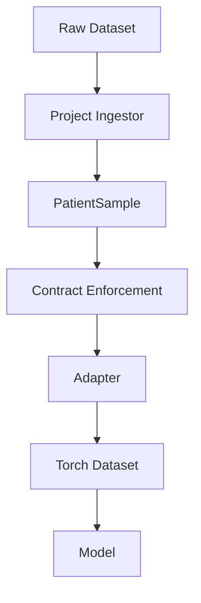
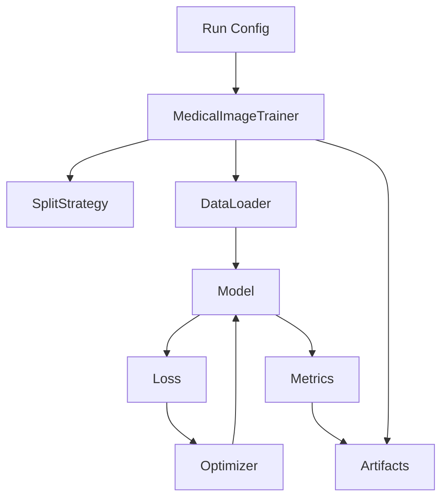

# Current State Design & Conventions

**Project:** Coronary CT ML Pipeline  
**Last Updated:** 2026-01-31  
**Status:** Active — authoritative snapshot of current architecture and conventions

### Tooling Dependencies

Traceability artifacts are generated using:
- regulatory-tools v0.1.0
- medical-image-ai-toolkit v0.1.0

---

## 1. Purpose & Scope

This document defines the **current, authoritative design state** of the system.

It specifies:
- Existing abstractions and boundaries
- Ownership of responsibilities
- Enforced contracts and assumptions
- Conventions considered *locked*

**Goals**
- Reduce cognitive load
- Prevent architectural drift
- Support implementation, testing, onboarding, and audit readiness

**Out of Scope**
- Historical rationale (captured in Design History / DHF-lite)
- Future or experimental behavior (explicitly marked when present)

---

## 2. Architectural Overview

### Core Design Principle

The system is split into **framework** and **project** code:

| Layer | Responsibility | Constraints |
|------|----------------|-------------|
| `medical_image_ai_toolkit` | Reusable medical imaging ML framework | Importable as external package; dataset-agnostic |
| `coronary_prj` | Project- and dataset-specific logic | Owns all CAC- and dataset-specific semantics |

Framework code **must not** encode project assumptions.

---

## 3. Global Process & Conventions

| Convention | Status |
|-----------|--------|
| “Validation” is a reserved word | Enforced |
| Regulatory-ready development mindset | Required |
| Reporting & artifact generation | First-class |
| Silent failure at system boundaries | Disallowed |
| Errors & deviations | Must generate auditable evidence |

All boundary checks must emit **EvidenceReports**.

---

## 4. Canonical Data Contract

### `PatientSample` (Authoritative)

The **only** canonical patient-level data representation.

#### Guaranteed Fields

| Field | Type | Notes |
|-------|------|------
| `image_volume` | `np.ndarray` | Shape `(z, y, x)` |
| `spacing` | `(z, y, x)` tuple | All values > 0 |
| `patient_id` | `str` | Non-empty |
| `annotations` | Optional | Vector ROIs or dense raster mask |

#### Contract Enforcement

All enforcement occurs via:

```python
enforce_patient_sample_contract(...)
```

#### Behavior
- Checks required fields and invariants
- Validates annotation bounds and structure
- Supports vector and dense annotations
- Emits an EvidenceReport containing:
  - INFO: confirmed assumptions
  - WARNING: non-fatal deviations
  - ERROR: contract violations

#### Rules
- This is the single authoritative contract boundary
- Downstream code assumes validated inputs
- No downstream re-validation is permitted

## 5. Data Contract Enforcement & Evidence

### Purpose (Not Clinical Validation)

| Objective | Included |
|----------|----------|
| Structural correctness | Yes |
| Semantic alignment | Yes |
| Early ingestion error detection | Yes |
| Clinical or model validation | No |

### Enforcement Principles

- Explicit and centralized
- Performed at defined boundaries
- Produces evidence, not exceptions
- Independent of tests and runtime logging

### Evidence Reports

EvidenceReports are first-class artifacts:
- Logged, persisted, or attached to runs
- Support debugging, audits, and dataset characterization
- Distinct from assertions or logs

---

## 6. Framework: `medical_image_ai_toolkit`

### Scope & Constraints

| Allowed | Forbidden |
|--------|-----------|
| Trainers | Dataset-specific logic |
| Datamodules | Project-specific labels |
| Adapters | Hard-coded paths or splits |
| Task abstractions | Cohort semantics |
| Losses and metrics | |

Toolkit code consumes resolved patient identities.  
Patient identity resolution is a project responsibility.

---

### MedicalImageTrainer

Reusable, dataset-agnostic training container.

Responsibilities:
- Orchestrate training
- Accept configuration (not raw data)
- Load data lazily
- Capture all training artifacts

Explicitly excludes:
- Dataset semantics
- Split policy
- Task semantics

---

## 7. Project: `coronary_prj`

### Responsibilities

| Category | Owned by Project |
|---------|------------------|
| Dataset ingestion (e.g. COCA) | Yes |
| Dataset splits | Yes |
| Task selection | Yes |
| Label semantics | Yes |
| Visualization and debugging | Yes |
| Training scripts | Yes |

All CAC-specific logic lives here.

---

## 8. Dataset Splits (Current State)

| Aspect | Policy |
|--------|--------|
| Strategy | Deterministic hash(patient_id) |
| Ownership | Project-level |
| Reproducibility | Required |
| Documentation | Required |
| Trainer role | Consumes split as configuration |

---

## 9. Training Artifacts & Traceability

Training runs are first-class artifacts.

Each run must capture:
- Dataset roots
- Split strategy and parameters
- Model configuration
- Training parameters
- Metrics (including validation)
- Visual evidence where applicable

Purpose:
- Debugging
- Reproducibility
- Regulatory submission readiness

| Artifact | Filename | Purpose |
|--------|----------|---------|
| Run configuration | `run_config.json` | Records training intent, dataset, model, optimization parameters, and reproducibility anchors |
| Data splits | `data_splits.json` | Exact patient IDs and slice counts used for training and validation |
| Training metrics | `metrics.json` | Per-epoch training and validation loss (time-series evidence) |
| Training summary | `training_summary.json` | Human-readable summary of run outcome and best epoch |
| Model weights | `model.pt` | Trained model state dictionary |
| Evidence report | `evidence.json` | Regulatory-facing narrative and traceability notes |
| Training curve plot | `training_curve.png` | Visualization of training and validation loss over epochs |


---

## 10. Data & Training Flow

### Data Flow



### Training Loop

## 11. Experiment Abstractions

### Design Principle

Policy is flexible; contracts are enforced.

The framework defines invariants and interfaces.  
The project selects and configures concrete implementations.

---

## 11.1 SplitStrategy

A SplitStrategy defines a deterministic policy for assigning patient identities to dataset subsets (e.g. train, val, test).

### Responsibilities

A SplitStrategy must:
- Operate at the patient_id level
- Be deterministic and reproducible
- Avoid patient leakage across splits
- Expose metadata sufficient for audit and artifact capture

### Framework Role (medical_image_ai_toolkit)

The framework provides:
- A formal SplitStrategy interface
- Validation of split invariants (determinism, exclusivity, non-emptiness)
- Optional reusable base implementations (e.g. hash-based splits)

The framework does not encode dataset- or project-specific cohort logic.

### Project Role (coronary_prj)

The project is responsible for:
- Selecting a SplitStrategy
- Providing configuration parameters (e.g. ratios, seeds)
- Defining dataset-specific inclusion or exclusion rules

The trainer accepts the SplitStrategy as configuration input and records its identity and parameters as part of training artifacts.

---

### Split Strategy Naming & Design Conventions (Normative)

Purpose:
Split strategies are first-class, screenable training inputs.  
Names must clearly communicate behavior, not intent.

#### Naming Rules

1. Names MUST describe behavior, not intent

Allowed:
- DeterministicHoldoutSplitStrategy
- HashBasedPatientSplitStrategy
- TemporalHoldoutSplitStrategy
- StratifiedLabelHoldoutSplitStrategy

Disallowed:
- SmokeSplitStrategy
- DebugSplitStrategy
- ToySplit
- DefaultSplit

Intent belongs at the run-metadata level, not in the split abstraction.

2. Names MUST encode the primary split mechanism

Examples:
- Deterministic → no randomness
- HashBased → hash-derived assignment
- Temporal → time-ordered split
- Stratified → label-aware balancing

Avoid vague names that hide mechanics.

3. Dataset- or project-specific names are forbidden

Not allowed:
- COCASplitStrategy
- CoronaryHoldoutSplit
- CACPatientSplit

Dataset knowledge belongs in project configuration, not toolkit abstractions.

---

### Structural Requirements (Normative)

All SplitStrategy implementations MUST:
- Operate at the patient level
- Input unique patient_ids
- Avoid slice-, patch-, or sample-level assignment
- Be deterministic
- Produce identical outputs for identical inputs
- Explicitly seed and record any randomness
- Be auditable
- Implement metadata() returning JSON-serializable configuration
- Fully describe how the split was generated
- Be screenable
- Support invariant validation (e.g. no leakage, no empty splits)

The trainer may reject invalid strategies before data loading or training.

---

### Split Intent Declaration (Project-Level)

Intent MUST NOT be encoded in the split strategy name.

Intent is captured via:
- Training run metadata
- Experiment configuration
- Artifact annotations

Example:
```json
{
  "split_strategy": "DeterministicHoldoutSplitStrategy",
  "run_intent": "smoke_validation"
}
```

## 11.2 TaskDefinition

A TaskDefinition specifies the learning objective applied to the dataset.

A task defines:
- How targets are derived from a validated PatientSample
- Expected model outputs
- Loss function
- Metrics

---

### Responsibilities

A TaskDefinition must:
- Declare input and output expectations
- Define a loss compatible with declared outputs
- Provide appropriate, deterministic metrics
- Be internally self-consistent and screenable

---

### Framework Role (medical_image_ai_toolkit)

The framework provides:
- A formal TaskDefinition interface
- Validation of task consistency (e.g. output–loss compatibility)
- Optional abstract task types (classification, regression, segmentation)

The framework does not encode label semantics or clinical meaning.

---

### Project Role (coronary_prj)

The project is responsible for:
- Implementing concrete task definitions
- Encoding dataset- and domain-specific label semantics
- Selecting the task for a training run

---

### Task Definition: Training Semantics Contract

Purpose:
A TaskDefinition formalizes the semantic meaning of a training run.

It defines:
- What model outputs represent
- What targets mean
- Which loss functions are valid
- Which metrics are computed
- What assumptions downstream code may rely on

Task definitions decouple model mechanics from project or clinical intent.

---

### Task Naming Conventions (Normative)

1. Names MUST describe learning semantics, not dataset or intent

Allowed:
- BinaryClassificationTask
- MultiClassClassificationTask
- RegressionTask
- SegmentationTask

Disallowed:
- CACClassificationTask
- CoronaryTask
- SmokeTask
- DebugTask

2. Task names MUST reflect model outputs

Example:
- BinaryClassificationTask → scalar output, binary target, sigmoid/logit loss

---

### Structural Requirements (Normative)

All TaskDefinition implementations MUST:
- Declare input and output contracts
- Specify expected model output shape
- Specify target shape and dtype
- Provide loss construction (torch.nn.Module)
- Ensure loss compatibility with outputs
- Declare metrics
- Ensure metrics are deterministic and side-effect free
- Be auditable
- Implement metadata() returning JSON-serializable configuration
- Fully describe task semantics in metadata

---

### Separation of Concerns

TaskDefinition implementations MUST NOT:
- Load data
- Perform dataset splits
- Contain dataset-specific label logic
- Encode project or clinical intent

They MAY:
- Validate model outputs and targets
- Normalize or post-process outputs for metrics
- Define multiple metrics over the same outputs

---

### Task Intent Declaration (Project-Level)

Task intent MUST NOT be encoded in the TaskDefinition itself.

Intent is captured at the training run level via:
- Configuration
- Artifact metadata
- Evidence reports

Example:
```json
{
  "task": "BinaryClassificationTask",
  "run_intent": "smoke_training"
}
```

## 12. Trainer Responsibilities

The MedicalImageTrainer:
- Accepts a SplitStrategy and TaskDefinition as configuration
- Validates both against framework-defined expectations
- Refuses execution if validation fails
- Captures split and task identity, configuration, and validation results as training artifacts

The trainer does not contain:
- Dataset-specific logic
- Task semantics
- Split policy decisions

---

## 13. Non-Normative Design Note: True Laziness & Future Tasks

This section documents architectural intent only.  
It does NOT describe current behavior.

### Observed Current Behavior

- Patient ingestion is lazy at the patient level
- Certain dataset constructions may trigger ingestion during dataset initialization
- This is acceptable for current local datasets and smoke-test workflows

### Future Design Intent

- Dataset construction never touches data
- Dataset length and indexing derive from metadata only
- Only __getitem__ triggers data access
- Ingestors may read from disk, object storage, or remote sources transparently

### Target Mental Model

Indexes are metadat, not data.


### Change Policy for This Section

Adopting this model will require:
- Explicit design changes
- Updates to this document
- A Design History (DHF-lite) entry

Until then, current behavior remains authoritative.

---

## 14. Current Status

- PatientSample contract finalized
- Contract enforcement system complete and tested
- Adapter tests passing
- Training architecture defined but not yet executed

Next step: smoke-test training run with visual outputs.

---
## 15. EvidenceReport Usage: Design Intent and Conventions

### Overview

The project uses a unified `EvidenceReport` mechanism to capture structured evidence across unit testing, integration testing, and model training execution. This is an intentional design choice to support traceability, determinism, and auditability in a regulated medical AI context.

`EvidenceReport` is treated as an evidence aggregation and transport layer, not as a test framework or metric computation engine.

---

### Core Principle

**EvidenceReport records claims and observations; it does not decide correctness.**

Assertions, validation logic, and metric computation remain outside of `EvidenceReport`.  
`EvidenceReport` exists to:
- document what was evaluated
- under what conditions
- in support of which requirement

---

### Supported Evidence Contexts

The same `EvidenceReport` class is used in multiple contexts, differentiated by intent and convention rather than by implementation.

#### 1. Unit & Verification Tests

Used during pytest execution to support formal verification of functional and technical requirements.

**Characteristics**
- Short-lived
- Requirement-centric
- Ends with explicit assertions (e.g., `assert not report.has_errors`)
- Evidence is generated only to support pass/fail claims

**Example usage**
```python
report = EvidenceReport(
    subject="MedicalImageTrainer → Deterministic Training"
)
```
**Purpose**

- Verify code behavior
- Support requirement traceability (e.g., CAC-FR-xx, CAC-TR-xx)
- Generate verifiable artifacts for CI and design history

**2. Training & Algorithmic Execution**

Used during training runs to capture algorithm behavior, metrics, and stability characteristics.

Characteristics
- Long-lived
- Metric-heavy
- No assertions
- Persisted alongside model artifacts
- Descriptive rather than pass/fail

Purpose
- Demonstrate determinism, convergence, numerical stability
- Capture training configuration and outcomes
- Support algorithm performance evidence without enforcing correctness**

**What EvidenceReport Is Not**

EvidenceReport is explicitly not:
- a test runner
- a metric calculator
- a control-flow mechanism
- a replacement for assertions or exceptions

Pipeline logic must not depend on the presence or contents of an EvidenceReport.

### Separation of Responsibility

| Concern | Owner |
|------|------|
| Pass / fail logic | `assert`, exceptions |
| Metric computation | Trainer / model code |
| Requirement enforcement | Contracts & validators |
| Evidence capture | `EvidenceReport` |
| Determinism guarantees | Explicit seeding & ordering logic |

This separation ensures that evidence collection never alters system behavior.

---

### Acceptability for Regulated ML Systems

This unified evidence mechanism aligns with common regulatory expectations (e.g., FDA SaMD, ISO 62304) by:
- Supporting traceability across development phases
- Preserving execution context and intent
- Allowing evidence generation at development, verification, and controlled runtime

Different claims are supported using the same mechanism, without conflating their meaning.

---

### Guardrails and Anti-Patterns

The following are explicitly discouraged:
- Using `EvidenceReport` to control logic flow
- Making training success dependent on evidence state
- Calling `assert` inside training code
- Coupling pipeline behavior to “test mode” vs “train mode”
- Treating metrics as implicit pass/fail signals

Violating these principles would blur the boundary between evidence and correctness and should be avoided.

---

### Summary

Using a single `EvidenceReport` mechanism across testing and training is a deliberate and appropriate architectural choice, provided that:
- intent is clearly signaled via subject and requirement IDs
- correctness is enforced outside the evidence layer
- evidence remains descriptive, contextual, and non-authoritative

This design supports scalability, auditability, and long-term maintainability without introducing unnecessary parallel systems.

---
## 15. !!!Change Policy (Normative)!!!

Any change that affects:
- Data contracts
- Module boundaries
- Training responsibilities
- SplitStrategy interfaces or invariants
- TaskDefinition interfaces or validation rules

Must:
- Update this document
- Trigger a new Design History (DHF-lite) entry
